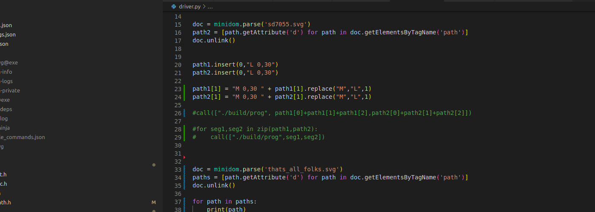

# svg_cnc

This project can be used to control two-axis carthesian robots. In its current configuration it can be used to control a four axis hot-wire cutter. This project is built using the meson build system and the plotting functions use the X11 library.
The [SVG path string](https://www.w3.org/TR/SVG/paths.html) is used directly as trajectory parameterization and as input to the main program. The composite quadratic or cubic bezier curves as well as the arc segments are decomposed into quadratic bezier curves which can then be followed at constant speed using an [analytical formula for their arclenth](https://members.loria.fr/SHornus/quadratic-arc-length.html) and Newton's method. This arc length parameterization allows the use of timing laws to make this controller suited for more dynamic applications, although the continuity of the trajectory has to be taken into account when doing this. The repo is structured as follows:

## bezdist.c

This program takes the coordinates of point _q_ in the complex plane, the number of control points _n_, and a pointer to an array of complex control points as inputs. The complex control points uniquely define a complex [Bézier Curve](https://en.wikipedia.org/wiki/B%C3%A9zier_curve) of degree _n_ - 1 that starts at the first control point and ends at the last control point. Complex coordinates are used for convenience only, they represent points in 2D. Their real part corresponds to the x-coordinate and their imaginary part to the y-coordinate. The program returns the closest distance between point _q_ and the curve specified by the control points.
This requires finding all real roots of a polynomial function of degree (2*_n_ - 3). This polynomial is also defined in the bernstein basis and its control values are computed by the function _rfcn_. The roots are found using an algorithm based on the [projected polyhedron algorithm](https://web.mit.edu/hyperbook/Patrikalakis-Maekawa-Cho/node42.html).

## graphic.c

This is the code used to display the current position and the traversed trajectory of the cursor or the machine. It only provides the bare minimum functionalities to visualize the output of the main program.

## svg_path.c

This file contains the code that parses the path string and traverses the trajectory. While traversing a segment of the path the subsequent segment is parsed from the string. Its type is then determined and the segment is then approximated by a composite quadratic bezier curve if it is an arc or a cubic bezier segment. This is done very quickly and the precision remains close to the floating point precision of the floats parsed from the input path string.

The main control loop is structured as follows:\
(for simplicity the case of a single trajectory and carthesian robot is illustrated here)

```{r, tidy=FALSE, eval=FALSE, highlight=FALSE }
  while (the current segment is not of type 'no command') do
  |
  |  if (the traversed arclength is greater than the length of the segment) then
  |  |  read the next segment from the path string
  |  |  [all required parameters including the length of the next segment
  |  |  are computed here]
  |  |  reset the bezier parameter u to 0
  |  |  reset the timer to 0
  |  end
  |
  | call the high level controller
  | [based on the timer (and potentially a timing law)
  | the traversed arclength is set to the desired value]
  |
  | call the low level controller
  | [if the end of the current segment has not yet been reached
  | - find the point on the segment that corresponds to the desired arclength
  | - compute the input to the hardware (potentially using feedback and a PID)]
  end
```
## qbez.c

This file contains the routines that approximate arcs and cubics by composite quadratic bezier curves, compute the arclength of the segment and evaluate the segment given a desired traversed arclength. The decomposition functions call the _bezdist_ program to evaluate whether the current approximation is precise enough.


